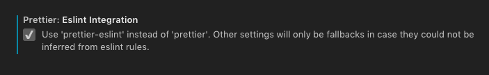
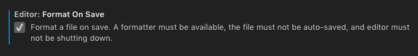
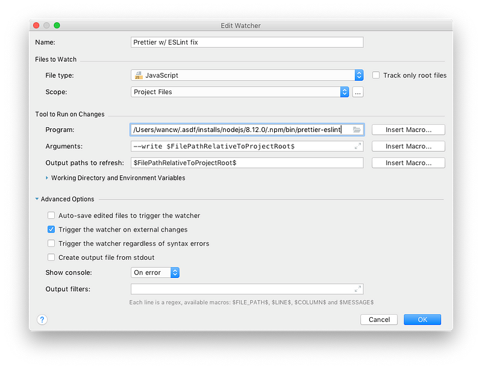

前篇 [Prettier + ESLint](/posts/2018/11/use-prettier-with-eslint/) 提過了兩者的合作方式，這篇主要是筆記在各主流 editor 下……

*   Prettier 與 ESLint 的 editor/IDE 外掛
*   「混用 Prettier 與 ESLint 格式」的設定
*   「存檔時自動排版」的設定

## VSCode

*   Extensions: [Prettier](https://marketplace.visualstudio.com/items?itemName=esbenp.prettier-vscode), [ESLint](https://marketplace.visualstudio.com/items?itemName=dbaeumer.vscode-eslint)

*   Prettier + ESLint: Turn on _Prettier: ESLint Integration_ (to use `prettier-eslint` instead)
   

* Turn on _Format on Save_
  

## Sublime Text 3

Packages:

*   [JsPrettifier](https://packagecontrol.io/packages/JsPrettier): provide a command to format the file
*   [SublimeLinter](https://packagecontrol.io/packages/SublimeLinter) + [SublimeLinter-eslint](https://packagecontrol.io/packages/SublimeLinter-eslint) to display lint status/message on UI
*   [ESLint Fix](https://packagecontrol.io/packages/ESLint%20Fix): provide a command & hotkeys to fix the file

Change settings of JsPrettifier:

```json
{  
  // To use `prettier-eslint`
  "prettier_cli_path": "<path_to_prettier-eslint>",  
  
  // Format on Save
  "auto_format_on_save": true,  
  "auto_format_on_save_excludes": [  
    "*node_modules/*",  
    "*.json"  
  ]  
}
```

Vim 跟 WebStorm 的 Prettier plugin 都無法直接改用 prettier-eslint，所以

1.  要用較複雜的方式存檔時自動格式化
2.  plugin 提供的 UI 指令只能使用原本的 Prettier

## Vim

Plug-ins:

*   [scrooloose/syntastic](http://github.com/scrooloose/syntastic) ⇒ display linter (ESLint) error & messages
*   [prettier/vim-prettier](https://github.com/prettier/vim-prettier) ⇒ provide command `:Prettier` (without `eslint --fix`)

Add settings to `.vimrc`:

```vimrc
""" Use ESLint as linter of JavaScript
let g:syntastic_javascript_checkers = ['eslint']
let g:syntastic_javascript_eslint_exec = 'eslint'

"""
""" for "Format on Save"
"""
autocmd BufWritePre
    \ *.js,*.jsx,*.mjs,*.ts,*.tsx,*.json,*.vue
    \ Prettier
set autoread  " Reload if file is changed outside of Vim

let g:syntastic_javascript_eslint_args = [‘--fix’]
function! SyntasticCheckHook(errors)
  checktime  " Check file changes
endfunction
```
## WebStorm

All necessary plugins are built-in:

*   JavaScript Support (for ESLint): display lint status & messages, and provide `Fix ESLint problems` command
*   Prettier: provide `Reformat with Prettier` command (w/o `eslint --fix`)

Use File Watcher to _Format on Save_

